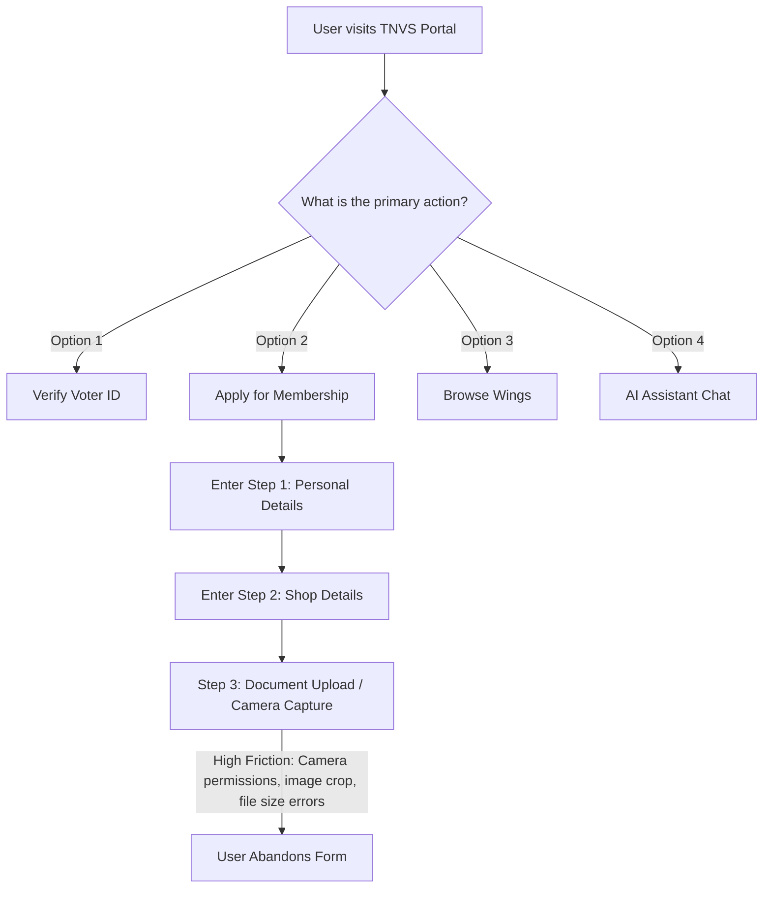

# TNVS Trader Portal UI/UX Audit

This document presents a comprehensive, critical, and specialized UI/UX audit of the Tamil Nadu Vanigargalin Sangamam (TNVS) Trader Portal codebase, route views, and components.

---

## Executive Summary

The TNVS Trader Portal serves as the official digital gateway for retail traders across Tamil Nadu. It provides critical services including Govt.-approved premium membership registration, digital Voter ID card generation, Sangamam Wing navigation, and an AI chat assistant.

While the portal incorporates a highly authentic and localized light parchment-and-navy styling system, our deep structural audit has identified several critical visual and interaction bottlenecks. The primary issues stem from:
1. **Interactive Scroll Friction**: High-frequency horizontal and stack animations (`HorizontalSteps.tsx` and `StackedServices.tsx`) creating visual spacing bugs and layout gaps on large displays.
2. **Bilingual Typography & Sizing Distortions**: Tamil text width extensions causing line overflows, container clippings, and vertical alignment shifts relative to English text equivalents.
3. **Mobile Form Friction**: Traditional, non-technical small-shop owners face high cognitive loads in the multi-step `membership.tsx` form wizard due to dense field grids and manual camera/upload toggles.
4. **Credential Card Scaling**: The `VoterIdCard` credential template lacks fluid vector scaling on narrow touch displays (320px-360px), causing horizontal overflows on mobile screens.

This audit establishes a solid foundation of visual and structural improvements before proceeding with any layout changes.

---

## Major UX Problems

### 1. Membership Registration Form Overhead (`src/routes/membership.tsx`)
* **Problem**: The timeline stepper is visually dense and lacks granular feedback. For traditional retail traders, a 5-step form with 20+ total fields, required documents (business proof, photo, ID proof), and real-time validation checks causes cognitive fatigue.
* **Why it matters**: Non-technical traders are highly likely to drop off at Step 3 (Document Upload/Camera capture) or during validation errors because the form fails to clearly indicate which fields are invalid or why a specific document format failed.
* **Impact**: Decreased registration conversion rates and increased support inquiries.

### 2. ID Card Search Verification Loop (`src/routes/voter-id.tsx`)
* **Problem**: The search feedback system is static. Searching for a voter registration record does not provide dynamic micro-loading status indicators, resulting in user confusion while the database search executes.
* **Why it matters**: A user might click the "Verify / Search" button multiple times, believing the page has frozen, which triggers redundant API requests.

### 3. Dynamic Section Navigation Flow (`src/routes/wings.tsx` and `src/routes/services.tsx`)
* **Problem**: Selecting filter chips (e.g., specific commercial wings like "Textile Wing", "Hardware Wing") requires heavy vertical scrolling on mobile because active chips do not automatically center or anchor the viewport to the filtered results.

---

## Major UI Problems

### 1. Section Spacing and Layout Gaps
* **Problem**: In the main `index.tsx` route, the scroll-driven stacking card deck (`StackedServices.tsx`) and steps horizontal scroll track (`HorizontalSteps.tsx`) suffer from layout gap bugs on high-DPI displays. Centered flex layouts (`items-center` on a full `100vh` sticky child) leave large white spaces at the top and bottom of the element once it unsticks.
* **Why it matters**: Creates an impression of an unpolished page, causing users to believe the site has ended or broken when they scroll past horizontal animations.

### 2. Contrast Ratios & Highlight Accents
* **Problem**: Saffron gold accent lines (`text-gold/80` or `border-gold/30`) are sometimes used as text elements on light backgrounds.
* **Why it matters**: Gold text on cream parchment fails WCAG AA contrast requirements (needs a minimum of 4.5:1), rendering the text completely illegible for older traders with vision impairments.

---

## User Friction Points

### 1. Input Field Focusing & Error Feedback (`src/components/FloatingInput.tsx`)
* **Problem**: The floating labels sometimes overlap with pre-filled browser credentials, resulting in illegible, stacked text characters. Focus indicators are thin, and validation errors are written in small red text (`text-xs`) that easily gets lost in dense layouts.
* **Why it matters**: Users with hand tremors or low vision struggle to locate the active input or identify which specific field is blocking the form submission.

### 2. Tamil Script Sizing and Character Clipping
* **Problem**: Tamil characters are wider and taller than Latin characters. Translating labels (e.g., "ஆவணம் சமர்ப்பிக்க" vs "Upload documents") increases text length by 30% to 50%.
* **Why it matters**: The increased length causes buttons to wrap to double lines, text grids to overlap, or borders to clip long Tamil characters.

---

## Visual Hierarchy Problems

### 1. Primary Action Clutter in Site Header (`src/components/SiteHeader.tsx`)
* **Problem**: The desktop header has multiple competing primary action links ("Portal login", "Apply Membership", "Verify Voter ID"). None are visually isolated or prioritized.
* **Why it matters**: First-time users are presented with too many paths, diluting the conversion rate of the primary goal: Membership Registration.

### 2. Services Stacking Contrast (`src/components/StackedServices.tsx`)
* **Problem**: As cards stack on scroll, the background dimming and scale-down effects are too uniform. The lack of card shadows or background contrast makes it hard to distinguish where one stacked card ends and the next begins.

---

## Typography Problems

### 1. Tamil Font Legibility on Mobile Devices
* **Problem**: Default browser sans-serif fonts are used on mobile if Google Fonts load slowly, causing Tamil text to render in ugly, default system glyphs that disrupt reading line spacing.
* **Why it matters**: Decreases trust and professional look of the portal.

### 2. Dense Line Heights
* **Problem**: Headings and descriptions use a tight line height (`line-height: 1.08` or `1.12` in `styles.css`) which is optimized for English display fonts (like Fraunces), but causes Tamil letters with upper/lower glyphs to overlap visually.

---

## Accessibility Problems

* **Focus States**: Several interactive buttons use `outline-none` without providing a custom `:focus-visible` ring wrapper, making keyboard navigation impossible.
* **Screen Reader Incompatibility**: Custom icon components (e.g., chevron arrows, checkmarks) lack `aria-hidden="true"` or explanatory screen reader tags (`sr-only`), resulting in screen readers reading out raw layout strings.
* **Color Blindness Limitations**: Status pills (`StatusPill.tsx`) rely exclusively on color (green for active, red for error) to communicate status, without incorporating descriptive icons (like checkmarks or warning symbols) to aid colorblind users.

---

## Mobile Responsiveness Problems

### 1. Voter ID Card Sizing (`src/components/VoterIdCard.tsx`)
* **Problem**: The SVG layout inside `VoterIdCard.tsx` has fixed aspect constraints. On narrow mobile viewports (e.g., iPhone SE at 320px width), the card bleeds off the right edge of the screen, creating horizontal layout scrollbars on the parent document.
* **Why it matters**: Users cannot view or take screenshots of their full credentials on small screens, and the export button is pushed out of view.

### 2. Filters Scroll Clunkiness (`src/routes/wings.tsx`)
* **Problem**: The horizontal scrollbar for filter chips lacks visual indicators, leaving mobile users unaware that more categories exist unless they accidentally swipe sideways.

---

## Cognitive Load Analysis

---

## Trust & Clarity Issues

* **Official Verification**: The verification screen lacks dynamic status messages (e.g., "Querying Govt. Registry...") that reassure users the check is authentic.
* **Secure Payment Clearance**: The payment screen (Step 4 of membership) does not display security badges or trusted gateway labels, creating hesitation for traditional shop owners before they pay the ₹500 fee.

---

## Recommended Priority Fixes

| Priority | Component / File | Issue | Proposed Solution |
| :--- | :--- | :--- | :--- |
| **1 (Critical)** | `src/components/VoterIdCard.tsx` | Visual overflow on small screen devices. | Wrap the card in a CSS scale transform container that scales down on screens smaller than 400px. |
| **2 (Critical)** | `src/routes/membership.tsx` | Visual form overload & validation errors. | Implement clearer group headings, progress indicator updates, and immediate inline validation feedback. |
| **3 (Major)** | `src/components/HorizontalSteps.tsx` | Layout spacing empty gap on unstick. | Shrink sticky container heights and align animation progress offsets to the stuck state. |
| **4 (Major)** | `src/components/SiteHeader.tsx` | Navigation link priority clutter. | Redesign the header buttons, moving auxiliary actions to secondary states and leaving one primary action. |
| **5 (Minor)** | `src/styles.css` | Tamil line height overlapping issues. | Set a specific, slightly taller line-height for Tamil elements (`line-height: 1.4` to `1.6`). |
